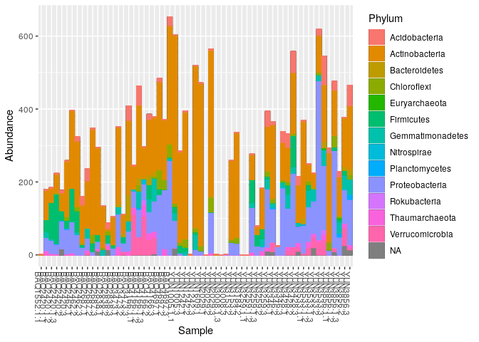
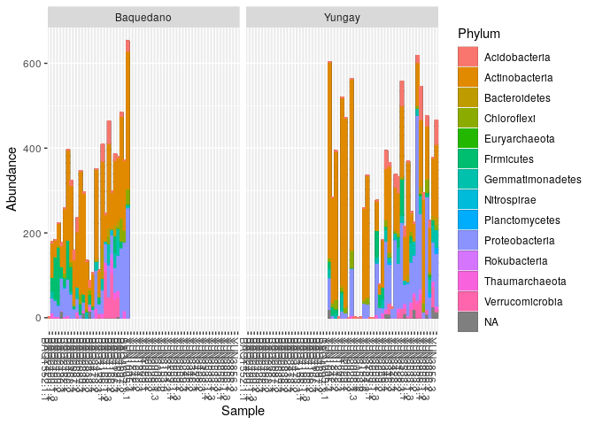
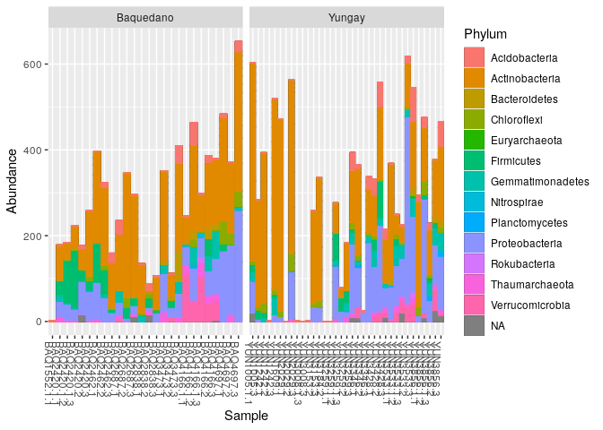
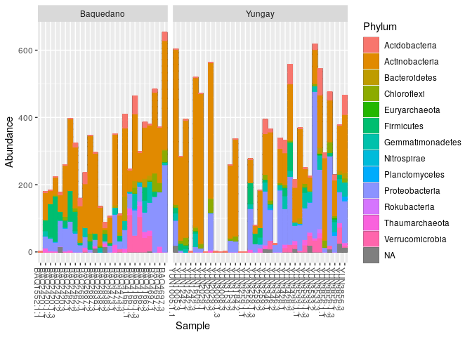
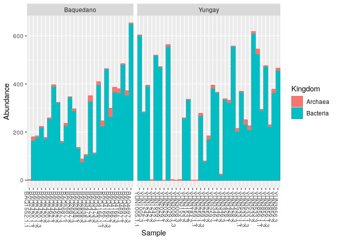

Resources
---------

This draws from [phyloseq plot\_bar
tutorial](https://joey711.github.io/phyloseq/plot_bar-examples.html).

Data
----

This tutorial uses the 1% Atacama subset data.

Getting ready
=============

First we load libraries.

``` r
library(readr)
library(phyloseq)
library(ggplot2)
library(dplyr)
```

``` r
atacama.ps = read_rds(atacama.ps.rds)
print(atacama.ps)
```

    ## phyloseq-class experiment-level object
    ## otu_table()   OTU Table:         [ 459 taxa and 61 samples ]
    ## sample_data() Sample Data:       [ 61 samples by 22 sample variables ]
    ## tax_table()   Taxonomy Table:    [ 459 taxa by 7 taxonomic ranks ]

Simple absolute abundance plot
------------------------------

Let’s start by making a simple absolute abundance bar plot with samples
on the x-axis and absolute abundance on the y-axis.

``` r
plot_bar(atacama.ps)
```


### Absolute abundance plot with kingdom

Now let’s look add the kingdom distribution of the reads. This is a good
sanity check for contamination - we expect the *vast* majority of our
reads to be bacterial.

First let’s look up the names of the taxonomic levels

``` r
rank_names(atacama.ps)
```

    ## [1] "Kingdom" "Phylum"  "Class"   "Order"   "Family"  "Genus"   "Species"

``` r
plot_bar(atacama.ps, fill="Kingdom")
```


### Getting rid of annoying black lines

You may have noticed that the bars are divided by short horizontal black
lines. This is because each bar actually consists of a stack of
sub-bars, each representing a different OTU. Usually the sub-bars
delineation are more confusing than helpful, so I prefer to get rid of
it. This isn’t that hard to do! by default `plot_bar` outlines each
sub-bar in black, but if we outline sub-bars with the same color as the
bar fill, we get rid of the delineation. Let’s re-make the *Absolute
abundance plot with kingdom* from above, but without the black sub-bar
outlines.

``` r
plot_bar(atacama.ps, fill="Kingdom") +
  geom_bar(aes(color=Kingdom, fill=Kingdom), stat="identity", position="stack")
```


### Absolute abundance plot with phyllum

Now do the same as above, but with coloring by phyllum instead of by
kingdom.

``` r
plot_bar(atacama.ps, fill="Phylum") +
  geom_bar(aes(color=Phylum, fill=Phylum), stat="identity", position="stack")
```



Facet Abundance Plots
---------------------

From our plots so far, we see some variation in number of reads per
sample. This is to be expected, but we want to be sure that there are no
confounding problems, for example, categories of samples that are
outliers. To this end, we can make facet plots to group samples by
different metadata features. Let’s remake the kingdom absolute abundance
plot so that samples are grouped by a variable, this will give us an
idea if there is a correlation between the variable and abundance.

First let’s see what variables are available.

``` r
sample_variables(atacama.ps)
```

    ##  [1] "BarcodeSequence"                 "LinkerPrimerSequence"           
    ##  [3] "Elevation"                       "ExtractConcen"                  
    ##  [5] "AmpliconConcentration"           "ExtractGroupNo"                 
    ##  [7] "TransectName"                    "SiteName"                       
    ##  [9] "Depth"                           "pH"                             
    ## [11] "TOC"                             "EC"                             
    ## [13] "AverageSoilRelativeHumidity"     "RelativeHumiditySoilHigh"       
    ## [15] "RelativeHumiditySoilLow"         "PercentRelativeHumiditySoil_100"
    ## [17] "AverageSoilTemperature"          "TemperatureSoilHigh"            
    ## [19] "TemperatureSoilLow"              "Vegetation"                     
    ## [21] "PercentCover"                    "Description"

``` r
get_variable(atacama.ps,"SiteName") %>%
  unique()
```

    ##  [1] "BAQ1552" "BAQ2420" "BAQ2462" "BAQ2687" "BAQ2838" "BAQ3473" "BAQ4166"
    ##  [8] "BAQ4697" "YUN1005" "YUN1242" "YUN1609" "YUN2029" "YUN3008" "YUN3153"
    ## [15] "YUN3184" "YUN3259" "YUN3346" "YUN3428" "YUN3533" "YUN3856"

That’s a lot of different values, it’s going to make an illegible plot.
Let’s try another one.

``` r
get_variable(atacama.ps,"TransectName")  %>%
  unique()
```

    ## [1] "Baquedano" "Yungay"

Two different values seems better

``` r
plot_bar(atacama.ps, facet_grid=~TransectName, fill="Phylum") +
  geom_bar(aes(color=Phylum, fill=Phylum), stat="identity", position="stack")
```



You might notice something weird things about the plot: There are large
spaces between samples without bars. Let’s try to fix this.

### “Missing” Values in Facet Plots

By default, the facets of a facet plot use the same scale. Often this is
the right thing to do - if the y-axis of each of the abundance plots had
a different scale, it would be hard to compare bars between the facets.
But sometimes it is not, such as our case. For the TransectName facet
plot, since the x-axis is samples, each sample has a place in each
facet, even though TransectName is mutually exclusive - each sample
corresponds to a specific site and depth combination, and each site
occurs in only one of the transects. Let’s fix the TransectName facet
plot so that each facet only shows the samples that correspond to that
Transect.

``` r
plot_bar(atacama.ps, facet_grid=~TransectName, fill="Phylum") +
  geom_bar(aes(color=Phylum, fill=Phylum), stat="identity", position="stack") +
  facet_grid(~TransectName, scale="free_x")
```



Once we fix that, you may notice that the facets default to being the
same size, despite the number of bars in the facet. Let’s adjust the
facet plot so the bars are all the same width, by making the size of the
facet proportional to the number bars in it by using the `space`
argument to `facet_grid`

``` r
plot_bar(atacama.ps, facet_grid=~TransectName, fill="Phylum") +
  geom_bar(aes(color=Phylum, fill=Phylum), stat="identity", position="stack") +
  facet_grid(~TransectName, scale="free_x", space = "free_x")
```



Are there any Kingdom biases by transect?

``` r
plot_bar(atacama.ps, facet_grid=~TransectName, fill="Kingdom") +
  geom_bar(aes(color=Kingdom, fill=Kingdom), stat="identity", position="stack") +
  facet_grid(~TransectName, scale="free_x", space = "free_x")
```



Session Info
============

Always print `sessionInfo` for reproducibility!

``` r
sessionInfo()
```

    ## R version 3.6.2 (2019-12-12)
    ## Platform: x86_64-pc-linux-gnu (64-bit)
    ## Running under: Ubuntu 18.04.3 LTS
    ## 
    ## Matrix products: default
    ## BLAS:   /usr/lib/x86_64-linux-gnu/blas/libblas.so.3.7.1
    ## LAPACK: /usr/lib/x86_64-linux-gnu/lapack/liblapack.so.3.7.1
    ## 
    ## locale:
    ##  [1] LC_CTYPE=en_US.UTF-8       LC_NUMERIC=C              
    ##  [3] LC_TIME=en_US.UTF-8        LC_COLLATE=en_US.UTF-8    
    ##  [5] LC_MONETARY=en_US.UTF-8    LC_MESSAGES=en_US.UTF-8   
    ##  [7] LC_PAPER=en_US.UTF-8       LC_NAME=C                 
    ##  [9] LC_ADDRESS=C               LC_TELEPHONE=C            
    ## [11] LC_MEASUREMENT=en_US.UTF-8 LC_IDENTIFICATION=C       
    ## 
    ## attached base packages:
    ## [1] stats     graphics  grDevices utils     datasets  methods   base     
    ## 
    ## other attached packages:
    ## [1] dplyr_0.8.3     ggplot2_3.2.1   phyloseq_1.30.0 readr_1.3.1    
    ## [5] knitr_1.27     
    ## 
    ## loaded via a namespace (and not attached):
    ##  [1] Rcpp_1.0.3          ape_5.3             lattice_0.20-38    
    ##  [4] Biostrings_2.54.0   assertthat_0.2.1    zeallot_0.1.0      
    ##  [7] digest_0.6.23       foreach_1.4.7       R6_2.4.1           
    ## [10] plyr_1.8.5          backports_1.1.5     stats4_3.6.2       
    ## [13] evaluate_0.14       pillar_1.4.3        zlibbioc_1.32.0    
    ## [16] rlang_0.4.2         lazyeval_0.2.2      data.table_1.12.8  
    ## [19] vegan_2.5-6         S4Vectors_0.24.3    Matrix_1.2-18      
    ## [22] rmarkdown_2.1       labeling_0.3        splines_3.6.2      
    ## [25] stringr_1.4.0       igraph_1.2.4.2      munsell_0.5.0      
    ## [28] compiler_3.6.2      xfun_0.12           pkgconfig_2.0.3    
    ## [31] BiocGenerics_0.32.0 multtest_2.42.0     mgcv_1.8-31        
    ## [34] htmltools_0.4.0     biomformat_1.14.0   tidyselect_0.2.5   
    ## [37] tibble_2.1.3        IRanges_2.20.2      codetools_0.2-16   
    ## [40] permute_0.9-5       crayon_1.3.4        withr_2.1.2        
    ## [43] MASS_7.3-51.5       grid_3.6.2          nlme_3.1-143       
    ## [46] jsonlite_1.6        gtable_0.3.0        lifecycle_0.1.0    
    ## [49] magrittr_1.5        scales_1.1.0        stringi_1.4.5      
    ## [52] farver_2.0.3        XVector_0.26.0      reshape2_1.4.3     
    ## [55] vctrs_0.2.1         Rhdf5lib_1.8.0      iterators_1.0.12   
    ## [58] tools_3.6.2         ade4_1.7-13         Biobase_2.46.0     
    ## [61] glue_1.3.1          purrr_0.3.3         hms_0.5.3          
    ## [64] parallel_3.6.2      survival_3.1-8      yaml_2.2.0         
    ## [67] colorspace_1.4-1    rhdf5_2.30.1        cluster_2.1.0

Start Time: 2020-11-06 16:28:23

End Time: 2020-11-06 16:29:42

Total Knit Time: 79.68 seconds

Total Knit Time: 1.33 minutes
