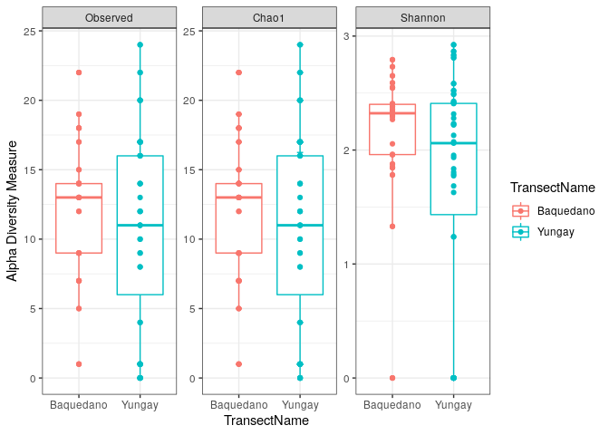
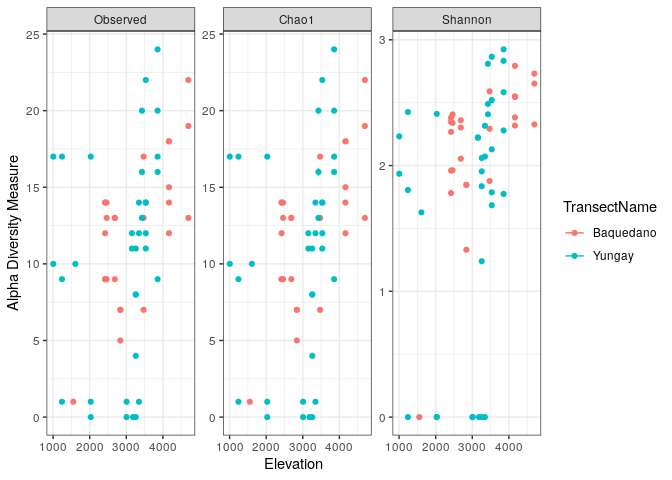
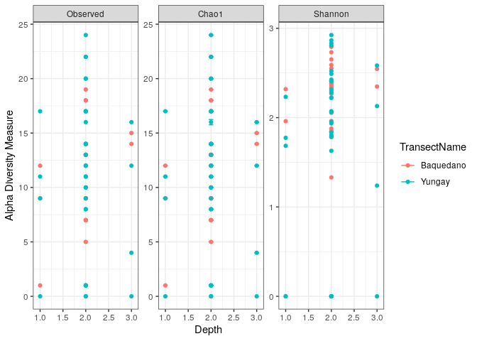

Resources
---------

This draws from [phyloseq plot\_bar
tutorial](https://joey711.github.io/phyloseq/plot_bar-examples.html).

Data
----

This tutorial uses the 10% Atacama subset data (note that for the demux
and dada2 tutorial we used the 1% Atacama subset)

Getting ready
=============

First we load libraries.

``` r
library(readr)
library(phyloseq)
library(ggplot2)
```

``` r
atacama.ps = read_rds(atacama.ps.rds)
print(atacama.ps)
```

    ## phyloseq-class experiment-level object
    ## otu_table()   OTU Table:         [ 459 taxa and 61 samples ]
    ## sample_data() Sample Data:       [ 61 samples by 22 sample variables ]
    ## tax_table()   Taxonomy Table:    [ 459 taxa by 7 taxonomic ranks ]

Visualize alpha-diversity
=========================

``` r
plot_richness(atacama.ps, x="TransectName", 
              measures=c("Observed", "Shannon", "Chao1"), color="TransectName") + theme_bw()
```

    ## Warning: Removed 126 rows containing missing values (geom_errorbar).


Let’s look at the data underlying the plots to check out what might be
causing the warning

``` r
estimate_richness(atacama.ps,
              measures=c("Observed", "Shannon","Chao1"))
```

    ##             Observed Chao1  se.chao1  Shannon
    ## BAQ1552.1.1        1     1 0.0000000 0.000000
    ## BAQ2420.1.1        9     9 0.0000000 1.959484
    ## BAQ2420.1.2        9     9 0.0000000 1.781663
    ## BAQ2420.1.3       14    14 0.0000000 2.347598
    ## BAQ2420.2         12    12 0.0000000 2.267915
    ## BAQ2420.3         14    14 0.0000000 2.380069
    ## BAQ2462.1         13    13 0.0000000 2.338360
    ## BAQ2462.2         14    14 0.0000000 2.406870
    ## BAQ2462.3          9     9 0.0000000 1.962158
    ## BAQ2687.1          9     9 0.0000000 2.054392
    ## BAQ2687.2         13    13 0.0000000 2.302198
    ## BAQ2687.3         13    13 0.0000000 2.360232
    ## BAQ2838.1          7     7 0.0000000 1.847525
    ## BAQ2838.2          7     7 0.0000000 1.845465
    ## BAQ2838.3          5     5 0.0000000 1.330298
    ## BAQ3473.1         13    13 0.0000000 2.292245
    ## BAQ3473.2          7     7 0.0000000 1.877287
    ## BAQ3473.3         17    17 0.0000000 2.589506
    ## BAQ4166.1.1       12    12 0.0000000 2.318281
    ## BAQ4166.1.2       14    14 0.0000000 2.383280
    ## BAQ4166.1.3       15    15 0.0000000 2.545070
    ## BAQ4166.2         18    18 0.0000000 2.792467
    ## BAQ4166.3         18    18 0.0000000 2.549834
    ## BAQ4697.1         19    19 0.0000000 2.651382
    ## BAQ4697.2         13    13 0.0000000 2.327429
    ## BAQ4697.3         22    22 0.0000000 2.730940
    ## YUN1005.1.1       17    17 0.0000000 2.232438
    ## YUN1005.3         10    10 0.0000000 1.934916
    ## YUN1242.1          9     9 0.0000000 1.805699
    ## YUN1242.2          1     1 0.0000000 0.000000
    ## YUN1242.3         17    17 0.0000000 2.425622
    ## YUN1609.1         10    10 0.0000000 1.627949
    ## YUN2029.1          0     0       NaN 0.000000
    ## YUN2029.2         17    17 0.0000000 2.410761
    ## YUN2029.3          1     1 0.0000000 0.000000
    ## YUN3008.1.3        0     0       NaN 0.000000
    ## YUN3008.3          1     1 0.0000000 0.000000
    ## YUN3153.2         12    12 0.0000000 2.220171
    ## YUN3153.3         11    11 0.0000000 2.224481
    ## YUN3184.2          0     0       NaN 0.000000
    ## YUN3259.1.1        0     0       NaN 0.000000
    ## YUN3259.1.2        8     8 0.0000000 1.835720
    ## YUN3259.1.3        4     4 0.0000000 1.238793
    ## YUN3259.2          8     8 0.0000000 1.953619
    ## YUN3259.3         11    11 0.0000000 2.060257
    ## YUN3346.1         14    14 0.0000000 2.316199
    ## YUN3346.2          1     1 0.0000000 0.000000
    ## YUN3346.3         12    12 0.0000000 2.071772
    ## YUN3428.1         16    16 0.2420615 2.489683
    ## YUN3428.2         20    20 0.0000000 2.809324
    ## YUN3428.3         13    13 0.0000000 2.407378
    ## YUN3533.1.1       11    11 0.0000000 1.684748
    ## YUN3533.1.2       14    14 0.0000000 2.521015
    ## YUN3533.1.3       12    12 0.0000000 2.128997
    ## YUN3533.2         14    14 0.0000000 1.787058
    ## YUN3533.3         22    22 0.0000000 2.865080
    ## YUN3856.1.1        9     9 0.0000000 1.774175
    ## YUN3856.1.2       17    17 0.0000000 2.279154
    ## YUN3856.1.3       16    16 0.0000000 2.583040
    ## YUN3856.2         20    20 0.0000000 2.832512
    ## YUN3856.3         24    24 0.0000000 2.923736

Alpha-Diversity Boxplots
------------------------

It is a bit hard to compare the two different transects because many
points are overlapping, let’s add a boxplot layer so we can compare the
distribution of alpha-diversity values between the transects.

``` r
plot_richness(atacama.ps, x="TransectName", 
              measures=c("Observed", "Shannon", "Chao1"), color="TransectName") + 
              geom_boxplot() +
              geom_point() +
              theme_bw() 
```



Alpha-Diversity as a function of other parameters
-------------------------------------------------

It also might be interesting to explore whether other parameters have an
effect on alpha-diversity

``` r
sample_variables(atacama.ps)
```

    ##  [1] "BarcodeSequence"                 "LinkerPrimerSequence"           
    ##  [3] "Elevation"                       "ExtractConcen"                  
    ##  [5] "AmpliconConcentration"           "ExtractGroupNo"                 
    ##  [7] "TransectName"                    "SiteName"                       
    ##  [9] "Depth"                           "pH"                             
    ## [11] "TOC"                             "EC"                             
    ## [13] "AverageSoilRelativeHumidity"     "RelativeHumiditySoilHigh"       
    ## [15] "RelativeHumiditySoilLow"         "PercentRelativeHumiditySoil_100"
    ## [17] "AverageSoilTemperature"          "TemperatureSoilHigh"            
    ## [19] "TemperatureSoilLow"              "Vegetation"                     
    ## [21] "PercentCover"                    "Description"

### Elevation

``` r
plot_richness(atacama.ps, x="Elevation", 
              measures=c("Observed", "Shannon", "Chao1"), color="TransectName") + theme_bw()
```



### Depth

``` r
plot_richness(atacama.ps, x="Depth", 
              measures=c("Observed", "Shannon", "Chao1"), color="TransectName") + theme_bw()
```



Session Info
============

Always print `sessionInfo` for reproducibility!

``` r
sessionInfo()
```

    ## R version 3.6.2 (2019-12-12)
    ## Platform: x86_64-pc-linux-gnu (64-bit)
    ## Running under: Ubuntu 18.04.3 LTS
    ## 
    ## Matrix products: default
    ## BLAS:   /usr/lib/x86_64-linux-gnu/blas/libblas.so.3.7.1
    ## LAPACK: /usr/lib/x86_64-linux-gnu/lapack/liblapack.so.3.7.1
    ## 
    ## locale:
    ##  [1] LC_CTYPE=en_US.UTF-8       LC_NUMERIC=C              
    ##  [3] LC_TIME=en_US.UTF-8        LC_COLLATE=en_US.UTF-8    
    ##  [5] LC_MONETARY=en_US.UTF-8    LC_MESSAGES=en_US.UTF-8   
    ##  [7] LC_PAPER=en_US.UTF-8       LC_NAME=C                 
    ##  [9] LC_ADDRESS=C               LC_TELEPHONE=C            
    ## [11] LC_MEASUREMENT=en_US.UTF-8 LC_IDENTIFICATION=C       
    ## 
    ## attached base packages:
    ## [1] stats     graphics  grDevices utils     datasets  methods   base     
    ## 
    ## other attached packages:
    ## [1] ggplot2_3.2.1   phyloseq_1.30.0 readr_1.3.1     knitr_1.27     
    ## 
    ## loaded via a namespace (and not attached):
    ##  [1] Rcpp_1.0.3          ape_5.3             lattice_0.20-38    
    ##  [4] Biostrings_2.54.0   assertthat_0.2.1    zeallot_0.1.0      
    ##  [7] digest_0.6.23       foreach_1.4.7       R6_2.4.1           
    ## [10] plyr_1.8.5          backports_1.1.5     stats4_3.6.2       
    ## [13] evaluate_0.14       pillar_1.4.3        zlibbioc_1.32.0    
    ## [16] rlang_0.4.2         lazyeval_0.2.2      data.table_1.12.8  
    ## [19] vegan_2.5-6         S4Vectors_0.24.3    Matrix_1.2-18      
    ## [22] rmarkdown_2.1       labeling_0.3        splines_3.6.2      
    ## [25] stringr_1.4.0       igraph_1.2.4.2      munsell_0.5.0      
    ## [28] compiler_3.6.2      xfun_0.12           pkgconfig_2.0.3    
    ## [31] BiocGenerics_0.32.0 multtest_2.42.0     mgcv_1.8-31        
    ## [34] htmltools_0.4.0     biomformat_1.14.0   tidyselect_0.2.5   
    ## [37] tibble_2.1.3        IRanges_2.20.2      codetools_0.2-16   
    ## [40] permute_0.9-5       crayon_1.3.4        dplyr_0.8.3        
    ## [43] withr_2.1.2         MASS_7.3-51.5       grid_3.6.2         
    ## [46] nlme_3.1-143        jsonlite_1.6        gtable_0.3.0       
    ## [49] lifecycle_0.1.0     magrittr_1.5        scales_1.1.0       
    ## [52] stringi_1.4.5       farver_2.0.3        XVector_0.26.0     
    ## [55] reshape2_1.4.3      vctrs_0.2.1         Rhdf5lib_1.8.0     
    ## [58] iterators_1.0.12    tools_3.6.2         ade4_1.7-13        
    ## [61] Biobase_2.46.0      glue_1.3.1          purrr_0.3.3        
    ## [64] hms_0.5.3           parallel_3.6.2      survival_3.1-8     
    ## [67] yaml_2.2.0          colorspace_1.4-1    rhdf5_2.30.1       
    ## [70] cluster_2.1.0

Start Time: 2020-11-06 16:30:02

End Time: 2020-11-06 16:30:10

Total Knit Time: 8.16 seconds

Total Knit Time: 0.14 minutes
