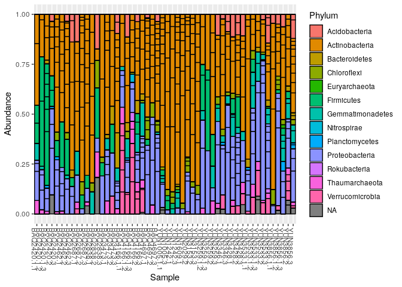
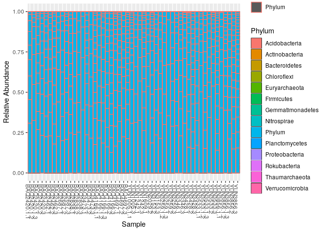
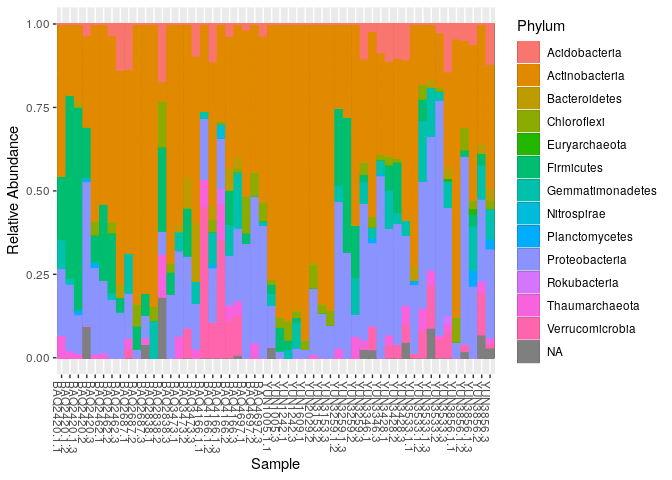
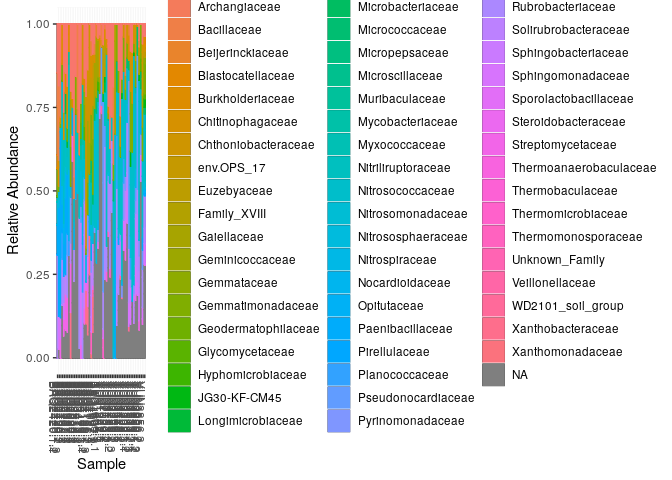
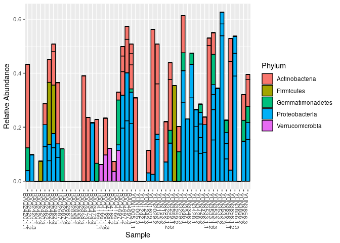
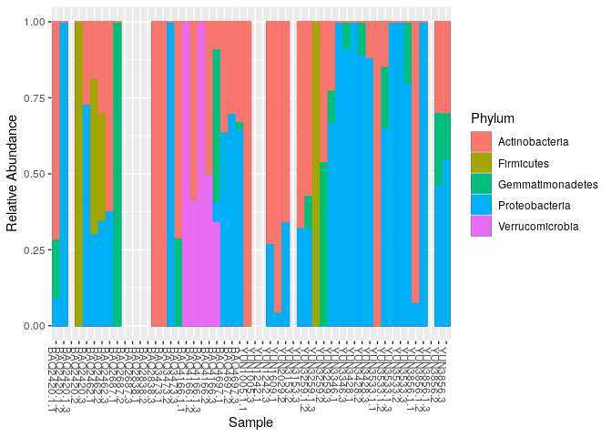
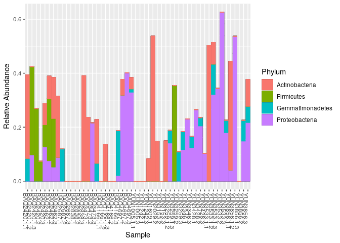
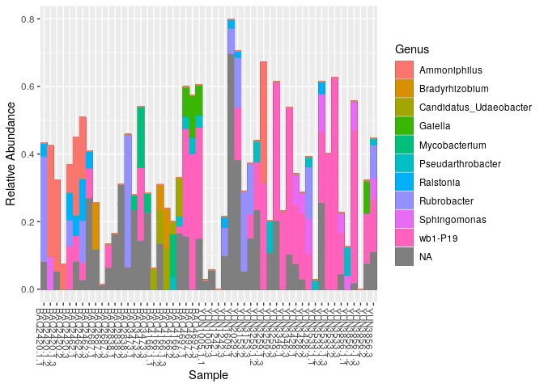
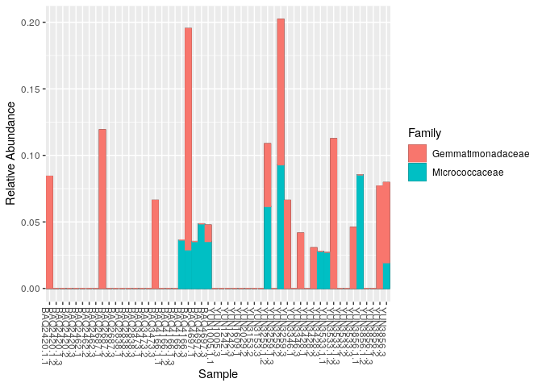

Data
----

This tutorial uses the 1% Atacama subset data.

Getting ready
=============

First we load libraries.

``` r
library(readr)
library(phyloseq)
library(tibble)
library(dplyr)
library(ggplot2)
```

``` r
# This chunk sets the RDS file to load the atacama phyloseq instance from. 
# It is a bit complicated to allow the RDS to be specified when this Rmd is knit from the commandline 

# Directories

if(exists("params") && 
   !is.null(params[["atacama_ps_rds"]])){
  atacama.ps.rds=params[["atacama_ps_rds"]]
} else {
  atacama.ps.rds = "/data/tutorial_data/atacama_10pct.rds"
  }
```

``` r
atacama.ps = read_rds(atacama.ps.rds)
print(atacama.ps)
```

    ## phyloseq-class experiment-level object
    ## otu_table()   OTU Table:         [ 459 taxa and 61 samples ]
    ## sample_data() Sample Data:       [ 61 samples by 22 sample variables ]
    ## tax_table()   Taxonomy Table:    [ 459 taxa by 7 taxonomic ranks ]

Relative Abundance
------------------

### Transform OTU table

Our OTU tables are currently raw counts

``` r
otu_table(atacama.ps)[1:10,1:9] %>%
  as.data.frame
```

    ##             GCGAGCGTTAATCGGAATCACTGGGCGTAAAGGGCGCGTAGGCGGTTAGGTAAGTCGGATGTGAAAGCCCTGGGCTTAACCTGGGAATGGCATTCGAGACTGTCTATCTAGAGTCTGGTAGAGGGAAGTGGAATTTCCGGTGTAGCGGTGAAATGTGTAGATATCGGAAGGAACACCAGTGGCGAAGGCGACTTCCTGGACCAAGACTGACGCTGAGGCGCGAAAGCGTGGGG
    ## BAQ1552.1.1                                                                                                                                                                                                                                         0
    ## BAQ2420.1.1                                                                                                                                                                                                                                         0
    ## BAQ2420.1.2                                                                                                                                                                                                                                         0
    ## BAQ2420.1.3                                                                                                                                                                                                                                         0
    ## BAQ2420.2                                                                                                                                                                                                                                           0
    ## BAQ2420.3                                                                                                                                                                                                                                           0
    ## BAQ2462.1                                                                                                                                                                                                                                           0
    ## BAQ2462.2                                                                                                                                                                                                                                           0
    ## BAQ2462.3                                                                                                                                                                                                                                           0
    ## BAQ2687.1                                                                                                                                                                                                                                           0
    ##             GCGAGCGTTAATCGGAATTACTGGGCGTAAAGGGCGCGTAGGCGGTTGGGTAAGTCGGGTGTGAAAGCCCTGGGCTTAACCTGGGAATGGCATTCGAGACTACCTAGCTAGAGTCTGGTAGAGGGAAGTGGAATTTCCGGTGTAGCGGTGAAATGTGTAGATATCGGAAGGAACACCAGTGGCGAAGGCGACTTCCTGGACCAAGACTGACGCTGAGGCGCGAAAGCGTGGGG
    ## BAQ1552.1.1                                                                                                                                                                                                                                         0
    ## BAQ2420.1.1                                                                                                                                                                                                                                         0
    ## BAQ2420.1.2                                                                                                                                                                                                                                         0
    ## BAQ2420.1.3                                                                                                                                                                                                                                         0
    ## BAQ2420.2                                                                                                                                                                                                                                           0
    ## BAQ2420.3                                                                                                                                                                                                                                          33
    ## BAQ2462.1                                                                                                                                                                                                                                          30
    ## BAQ2462.2                                                                                                                                                                                                                                          17
    ## BAQ2462.3                                                                                                                                                                                                                                          14
    ## BAQ2687.1                                                                                                                                                                                                                                           0
    ##             GCGAGCGTTAATCGGAATTACTGGGCGTAAAGGGCGCGTAGGCGGTGAAGTAAGTCGGGTGTGAAAGCCCCGGGCTCAACCTGGGAACTGCATCCGATACTGCTTCGCTAGAGTATGGTAGAGGGAAGCGGAATTCCGGGTGTAGCGGTGAAATGCGTAGATATCCGGAGGAACACCAGTGGCGAAGGCGGCTTCCTGGACCAATACTGACGCTGAGGCGCGAAAGCGTGGGG
    ## BAQ1552.1.1                                                                                                                                                                                                                                         0
    ## BAQ2420.1.1                                                                                                                                                                                                                                         0
    ## BAQ2420.1.2                                                                                                                                                                                                                                         0
    ## BAQ2420.1.3                                                                                                                                                                                                                                         0
    ## BAQ2420.2                                                                                                                                                                                                                                           0
    ## BAQ2420.3                                                                                                                                                                                                                                           0
    ## BAQ2462.1                                                                                                                                                                                                                                           0
    ## BAQ2462.2                                                                                                                                                                                                                                           0
    ## BAQ2462.3                                                                                                                                                                                                                                           0
    ## BAQ2687.1                                                                                                                                                                                                                                           0
    ##             GCGAGCGTTGTCCGGAATTATTGGGCGTAAAGAGCGTGTAGGCGGTTCGGTAAGTCTGCCGTGAAAACCTGGGGCTCAACCCCGGGCGTGCGGTGGATACTGCCGGGCTAGAGGATGGTAGAGGCGAGTGGAATTCCCGGTGTAGCGGTGAAATGCGCAGATATCGGGAGGAACACCAGTAGCGAAGGCGGCTCGCTGGGCCATTCCTGACGCTGAGACGCGAAAGCTAGGGG
    ## BAQ1552.1.1                                                                                                                                                                                                                                         0
    ## BAQ2420.1.1                                                                                                                                                                                                                                        55
    ## BAQ2420.1.2                                                                                                                                                                                                                                         0
    ## BAQ2420.1.3                                                                                                                                                                                                                                         0
    ## BAQ2420.2                                                                                                                                                                                                                                           0
    ## BAQ2420.3                                                                                                                                                                                                                                          20
    ## BAQ2462.1                                                                                                                                                                                                                                           0
    ## BAQ2462.2                                                                                                                                                                                                                                          40
    ## BAQ2462.3                                                                                                                                                                                                                                           0
    ## BAQ2687.1                                                                                                                                                                                                                                           0
    ##             GCGAGCGTTGTCCGGAATCACTGGGCGTAAAGGGCGCGTAGGCGGCCTGATAAGTAGGGGGTGAAATCCTGCGGCTTAACCGCAGGGCTGCCTTCTAAACTGTCAGGCTCGAGCACAGTAGAGGCAGGTGGAATTCCCGGTGTAGCGGTGGAATGCGTAGAGATCGGGAAGAACATCAGTGGCGAAGGCGGCCTGCTGGGCTGTTGCTGACGCTGAGGCGCGACAGCGTGGGG
    ## BAQ1552.1.1                                                                                                                                                                                                                                         0
    ## BAQ2420.1.1                                                                                                                                                                                                                                        15
    ## BAQ2420.1.2                                                                                                                                                                                                                                         0
    ## BAQ2420.1.3                                                                                                                                                                                                                                         0
    ## BAQ2420.2                                                                                                                                                                                                                                           0
    ## BAQ2420.3                                                                                                                                                                                                                                           0
    ## BAQ2462.1                                                                                                                                                                                                                                           0
    ## BAQ2462.2                                                                                                                                                                                                                                           0
    ## BAQ2462.3                                                                                                                                                                                                                                           0
    ## BAQ2687.1                                                                                                                                                                                                                                          28
    ##             GCTAGCGTTGTCCGGATTTATTGGGCGTAAAGAGCTCGTAGGCGGCCTGGTGAGTCGGGTGTGAAAGCCCGAGGCTCAACCTCGGAATTGCATTCGATACTGCTGGGCTTGAGGCAGGTAGGGGAGGATGGAATTCCCGGTGTAGCGGTGGAATGCGCAGATATCGGGAGGAACACCTGCGGCGAAGGCGGTCCTCTGGGCCTGTCCTGACGCTGAGGAGCGAAAGCGTGGGG
    ## BAQ1552.1.1                                                                                                                                                                                                                                         0
    ## BAQ2420.1.1                                                                                                                                                                                                                                         0
    ## BAQ2420.1.2                                                                                                                                                                                                                                         0
    ## BAQ2420.1.3                                                                                                                                                                                                                                         0
    ## BAQ2420.2                                                                                                                                                                                                                                           0
    ## BAQ2420.3                                                                                                                                                                                                                                           0
    ## BAQ2462.1                                                                                                                                                                                                                                          33
    ## BAQ2462.2                                                                                                                                                                                                                                           9
    ## BAQ2462.3                                                                                                                                                                                                                                          36
    ## BAQ2687.1                                                                                                                                                                                                                                           0
    ##             GCGAGCGTTAATCGGAATTACTGGGCGTAAAGGGCGCGTAGGCGGTGAAGTAAGTCGGGTGTGAAAGCCCCGGGCTCAACCTGGGAACTGCATTCGATACTGCTTCGCTAGAGTATGGTAGAGGGAAGCGGAATTCCGGGTGTAGCGGTGAAATGCGTAGATATCCGGAGGAACACCAGTGGCGAAGGCGGCTTCCTGGACCAATACTGACGCTGAGGCGCGAAAGCGTGGGG
    ## BAQ1552.1.1                                                                                                                                                                                                                                         0
    ## BAQ2420.1.1                                                                                                                                                                                                                                         0
    ## BAQ2420.1.2                                                                                                                                                                                                                                         0
    ## BAQ2420.1.3                                                                                                                                                                                                                                         0
    ## BAQ2420.2                                                                                                                                                                                                                                           0
    ## BAQ2420.3                                                                                                                                                                                                                                           0
    ## BAQ2462.1                                                                                                                                                                                                                                           0
    ## BAQ2462.2                                                                                                                                                                                                                                           0
    ## BAQ2462.3                                                                                                                                                                                                                                           0
    ## BAQ2687.1                                                                                                                                                                                                                                           0
    ##             GCAAGCGTTGTCCGGAATTATTGGGCGTAAAGAGCTCGTAGGCGGTCTGTCGCGTCGGCTGTGAAAACTCGGGGCTCAACTCCGAGCTTGCAGTCGATACGGGCAGGCTAGAGTTCGGCAGGGGAGACTGGAATTCCTGGTGTAGCGGTGAAATGCGCAGATATCAGGAGGAACACCGGTGGCGAAGGCGGGTCTCTGGGCCGATACTGACGCTGAGGAGCGAAAGCGTGGGG
    ## BAQ1552.1.1                                                                                                                                                                                                                                         0
    ## BAQ2420.1.1                                                                                                                                                                                                                                         0
    ## BAQ2420.1.2                                                                                                                                                                                                                                         0
    ## BAQ2420.1.3                                                                                                                                                                                                                                         0
    ## BAQ2420.2                                                                                                                                                                                                                                           0
    ## BAQ2420.3                                                                                                                                                                                                                                           0
    ## BAQ2462.1                                                                                                                                                                                                                                           0
    ## BAQ2462.2                                                                                                                                                                                                                                           0
    ## BAQ2462.3                                                                                                                                                                                                                                           0
    ## BAQ2687.1                                                                                                                                                                                                                                           0
    ##             GCAAGCGTTGTCCGGAATCATTGGGCGTAAAGAGCGTGTAGGCGGTCCGGTAAGTCGGCTGTGAAAGTCCAGGGCTCAACCCTGGGATGCCGGTCGATACTGCCGGACTAGAGTTCGGAAGAGGCGAGTGGAATTCCCGGTGTAGCGGTGAAATGCGCAGATATCGGGAGGAACACCTATGGCGAAGGCAGCTCGCTGGGACGTTACTGACGCTGAGACGCGAAAGCGTGGGG
    ## BAQ1552.1.1                                                                                                                                                                                                                                         0
    ## BAQ2420.1.1                                                                                                                                                                                                                                         0
    ## BAQ2420.1.2                                                                                                                                                                                                                                         0
    ## BAQ2420.1.3                                                                                                                                                                                                                                         0
    ## BAQ2420.2                                                                                                                                                                                                                                           0
    ## BAQ2420.3                                                                                                                                                                                                                                           0
    ## BAQ2462.1                                                                                                                                                                                                                                           0
    ## BAQ2462.2                                                                                                                                                                                                                                           0
    ## BAQ2462.3                                                                                                                                                                                                                                           0
    ## BAQ2687.1                                                                                                                                                                                                                                           0

Let’s change the column names so we can see more than one column at a
time

``` r
otu_table(atacama.ps)[1:10,1:9] %>%
  as.data.frame %>%
  setNames(seq(ncol(.))) # number columns so we can see more than one at a time
```

    ##             1  2 3  4  5  6 7 8 9
    ## BAQ1552.1.1 0  0 0  0  0  0 0 0 0
    ## BAQ2420.1.1 0  0 0 55 15  0 0 0 0
    ## BAQ2420.1.2 0  0 0  0  0  0 0 0 0
    ## BAQ2420.1.3 0  0 0  0  0  0 0 0 0
    ## BAQ2420.2   0  0 0  0  0  0 0 0 0
    ## BAQ2420.3   0 33 0 20  0  0 0 0 0
    ## BAQ2462.1   0 30 0  0  0 33 0 0 0
    ## BAQ2462.2   0 17 0 40  0  9 0 0 0
    ## BAQ2462.3   0 14 0  0  0 36 0 0 0
    ## BAQ2687.1   0  0 0  0 28  0 0 0 0

The first step in making relative abundance plots is to transform your
OTU table from raw counts to relative abundance (also known as
proportional or fractional abundance). Phyloseq provides the
`transform_sample_counts` function for performing user defined
transformations on the OTU table. We want to divide the counts for each
taxa in each sample by the total number of counts for that sample. The
phyloseq object returned has fractional “counts”:

``` r
# for each sample -> per taxon count/(counts for sample)
atacama.ps %>%
  transform_sample_counts(function(x) x / sum(x) ) ->
  atacama.ps.rel

otu_table(atacama.ps.rel)[1:40,1:9] %>%
  as.data.frame %>%
  setNames(seq(ncol(.))) # number columns so we can see more than one at a time
```

    ##                      1          2         3          4          5          6
    ## BAQ1552.1.1 0.00000000 0.00000000 0.0000000 0.00000000 0.00000000 0.00000000
    ## BAQ2420.1.1 0.00000000 0.00000000 0.0000000 0.30898876 0.08426966 0.00000000
    ## BAQ2420.1.2 0.00000000 0.00000000 0.0000000 0.00000000 0.00000000 0.00000000
    ## BAQ2420.1.3 0.00000000 0.00000000 0.0000000 0.00000000 0.00000000 0.00000000
    ## BAQ2420.2   0.00000000 0.00000000 0.0000000 0.00000000 0.00000000 0.00000000
    ## BAQ2420.3   0.00000000 0.12790698 0.0000000 0.07751938 0.00000000 0.00000000
    ## BAQ2462.1   0.00000000 0.07575758 0.0000000 0.00000000 0.00000000 0.08333333
    ## BAQ2462.2   0.00000000 0.05263158 0.0000000 0.12383901 0.00000000 0.02786378
    ## BAQ2462.3   0.00000000 0.08805031 0.0000000 0.00000000 0.00000000 0.22641509
    ## BAQ2687.1   0.00000000 0.00000000 0.0000000 0.00000000 0.11914894 0.00000000
    ## BAQ2687.2   0.00000000 0.00000000 0.0000000 0.00000000 0.00000000 0.00000000
    ## BAQ2687.3   0.00000000 0.00000000 0.0000000 0.00000000 0.00000000 0.00000000
    ## BAQ2838.1   0.00000000 0.00000000 0.0000000 0.00000000 0.00000000 0.00000000
    ## BAQ2838.2   0.00000000 0.00000000 0.0000000 0.00000000 0.00000000 0.00000000
    ## BAQ2838.3   0.00000000 0.00000000 0.0000000 0.39047619 0.00000000 0.00000000
    ## BAQ3473.1   0.00000000 0.00000000 0.0000000 0.00000000 0.00000000 0.00000000
    ## BAQ3473.2   0.21621622 0.00000000 0.0000000 0.00000000 0.00000000 0.00000000
    ## BAQ3473.3   0.00000000 0.00000000 0.0000000 0.00000000 0.06617647 0.00000000
    ## BAQ4166.1.1 0.00000000 0.00000000 0.0000000 0.00000000 0.00000000 0.00000000
    ## BAQ4166.1.2 0.00000000 0.00000000 0.0000000 0.00000000 0.00000000 0.00000000
    ## BAQ4166.1.3 0.00000000 0.00000000 0.0000000 0.00000000 0.00000000 0.00000000
    ## BAQ4166.2   0.00000000 0.00000000 0.0000000 0.00000000 0.00000000 0.00000000
    ## BAQ4166.3   0.02110818 0.00000000 0.0000000 0.00000000 0.16622691 0.00000000
    ## BAQ4697.1   0.00000000 0.00000000 0.1966874 0.00000000 0.00000000 0.00000000
    ## BAQ4697.2   0.00000000 0.00000000 0.1778976 0.00000000 0.00000000 0.00000000
    ## BAQ4697.3   0.00000000 0.00000000 0.2131902 0.00000000 0.01226994 0.00000000
    ## YUN1005.1.1 0.00000000 0.00000000 0.0000000 0.00000000 0.00000000 0.00000000
    ## YUN1005.3   0.00000000 0.00000000 0.0000000 0.00000000 0.00000000 0.00000000
    ## YUN1242.1   0.00000000 0.00000000 0.0000000 0.00000000 0.00000000 0.00000000
    ## YUN1242.2   0.00000000 0.00000000 0.0000000 0.00000000 0.00000000 0.00000000
    ## YUN1242.3   0.00000000 0.00000000 0.0000000 0.08285164 0.00000000 0.00000000
    ## YUN1609.1   0.00000000 0.00000000 0.0000000 0.00000000 0.00000000 0.53715499
    ## YUN2029.1          NaN        NaN       NaN        NaN        NaN        NaN
    ## YUN2029.2   0.00000000 0.00000000 0.0000000 0.14742451 0.00000000 0.00000000
    ## YUN2029.3   0.00000000 0.00000000 0.0000000 0.00000000 0.00000000 0.00000000
    ## YUN3008.1.3        NaN        NaN       NaN        NaN        NaN        NaN
    ## YUN3008.3   0.00000000 0.00000000 0.0000000 0.00000000 0.00000000 0.00000000
    ## YUN3153.2   0.00000000 0.00000000 0.0000000 0.00000000 0.00000000 0.00000000
    ## YUN3153.3   0.00000000 0.00000000 0.0000000 0.14880952 0.00000000 0.00000000
    ## YUN3184.2          NaN        NaN       NaN        NaN        NaN        NaN
    ##                     7   8          9
    ## BAQ1552.1.1 0.0000000   0 0.00000000
    ## BAQ2420.1.1 0.0000000   0 0.00000000
    ## BAQ2420.1.2 0.0000000   0 0.00000000
    ## BAQ2420.1.3 0.0000000   0 0.00000000
    ## BAQ2420.2   0.0000000   0 0.00000000
    ## BAQ2420.3   0.0000000   0 0.00000000
    ## BAQ2462.1   0.0000000   0 0.00000000
    ## BAQ2462.2   0.0000000   0 0.00000000
    ## BAQ2462.3   0.0000000   0 0.00000000
    ## BAQ2687.1   0.0000000   0 0.00000000
    ## BAQ2687.2   0.0000000   0 0.00000000
    ## BAQ2687.3   0.0000000   0 0.00000000
    ## BAQ2838.1   0.0000000   0 0.00000000
    ## BAQ2838.2   0.0000000   0 0.00000000
    ## BAQ2838.3   0.0000000   0 0.00000000
    ## BAQ3473.1   0.0000000   0 0.23646724
    ## BAQ3473.2   0.0000000   0 0.00000000
    ## BAQ3473.3   0.0000000   0 0.16176471
    ## BAQ4166.1.1 0.0000000   0 0.00000000
    ## BAQ4166.1.2 0.0000000   0 0.13606911
    ## BAQ4166.1.3 0.0000000   0 0.00000000
    ## BAQ4166.2   0.0000000   0 0.00000000
    ## BAQ4166.3   0.0000000   0 0.00000000
    ## BAQ4697.1   0.1221532   0 0.05797101
    ## BAQ4697.2   0.2237197   0 0.00000000
    ## BAQ4697.3   0.1165644   0 0.04141104
    ## YUN1005.1.1 0.0000000   0 0.00000000
    ## YUN1005.3   0.0000000   0 0.00000000
    ## YUN1242.1   0.0000000   0 0.00000000
    ## YUN1242.2   0.0000000   0 0.00000000
    ## YUN1242.3   0.0000000   0 0.00000000
    ## YUN1609.1   0.0000000   0 0.00000000
    ## YUN2029.1         NaN NaN        NaN
    ## YUN2029.2   0.0000000   0 0.00000000
    ## YUN2029.3   0.0000000   0 0.00000000
    ## YUN3008.1.3       NaN NaN        NaN
    ## YUN3008.3   0.0000000   0 0.00000000
    ## YUN3153.2   0.0000000   0 0.00000000
    ## YUN3153.3   0.0000000   0 0.00000000
    ## YUN3184.2         NaN NaN        NaN

> Why are there NaNs?

#### Exploring NaNs

Maybe division by zero? Let’s check

``` r
atacama.ps %>%
  sample_sums %>% 
  sort
```

    ##   YUN2029.1 YUN3008.1.3   YUN3184.2 YUN3259.1.1 BAQ1552.1.1   YUN1242.2 
    ##           0           0           0           0           1           1 
    ##   YUN2029.3   YUN3008.3   YUN3346.2 YUN3259.1.3   BAQ2838.2   BAQ2838.3 
    ##           1           1          24          79          87         105 
    ##   BAQ3473.2   BAQ2838.1   BAQ2462.3   BAQ2420.2 BAQ2420.1.1   YUN3259.2 
    ##         111         134         159         176         178         183 
    ## BAQ2420.1.2   YUN3428.3 BAQ2420.1.3 YUN3533.1.3 YUN3856.1.3   BAQ2687.1 
    ##         184         215         223         224         228         235 
    ## BAQ4166.1.1 YUN3533.1.2   BAQ2420.3   YUN3153.2 YUN3259.1.2   YUN1005.3 
    ##         245         249         258         259         276         284 
    ## YUN3856.1.1   BAQ2687.3 BAQ4166.1.3   BAQ2462.2   YUN3428.1   YUN3153.3 
    ##         293         295         297         323         332         336 
    ##   YUN3346.3   BAQ2687.2   BAQ3473.1   YUN3346.1 YUN3533.1.1   BAQ4697.2 
    ##         337         346         351         365         368         371 
    ##   YUN3856.2   BAQ4166.3   BAQ4166.2   YUN1242.1   YUN3259.3   BAQ2462.1 
    ##         377         379         385         393         393         396 
    ##   BAQ3473.3 BAQ4166.1.2   YUN3856.3   YUN1609.1 YUN3856.1.2   BAQ4697.1 
    ##         408         463         465         471         475         483 
    ##   YUN1242.3   YUN3533.3   YUN3428.2   YUN2029.2 YUN1005.1.1   YUN3533.2 
    ##         519         545         557         563         603         618 
    ##   BAQ4697.3 
    ##         652

Yes, there are several samples that have no counts, and a few more that
have very low counts

``` r
plot_bar(atacama.ps)
```


Let’s “prune” samples that have less counts of less than 50

``` r
sample_min_count = 50

atacama.ps %>%
  prune_samples(sample_sums(.)>=sample_min_count, .) ->
  atacama.prune_s.ps

sample_sums(atacama.prune_s.ps) %>% sort
```

    ## YUN3259.1.3   BAQ2838.2   BAQ2838.3   BAQ3473.2   BAQ2838.1   BAQ2462.3 
    ##          79          87         105         111         134         159 
    ##   BAQ2420.2 BAQ2420.1.1   YUN3259.2 BAQ2420.1.2   YUN3428.3 BAQ2420.1.3 
    ##         176         178         183         184         215         223 
    ## YUN3533.1.3 YUN3856.1.3   BAQ2687.1 BAQ4166.1.1 YUN3533.1.2   BAQ2420.3 
    ##         224         228         235         245         249         258 
    ##   YUN3153.2 YUN3259.1.2   YUN1005.3 YUN3856.1.1   BAQ2687.3 BAQ4166.1.3 
    ##         259         276         284         293         295         297 
    ##   BAQ2462.2   YUN3428.1   YUN3153.3   YUN3346.3   BAQ2687.2   BAQ3473.1 
    ##         323         332         336         337         346         351 
    ##   YUN3346.1 YUN3533.1.1   BAQ4697.2   YUN3856.2   BAQ4166.3   BAQ4166.2 
    ##         365         368         371         377         379         385 
    ##   YUN1242.1   YUN3259.3   BAQ2462.1   BAQ3473.3 BAQ4166.1.2   YUN3856.3 
    ##         393         393         396         408         463         465 
    ##   YUN1609.1 YUN3856.1.2   BAQ4697.1   YUN1242.3   YUN3533.3   YUN3428.2 
    ##         471         475         483         519         545         557 
    ##   YUN2029.2 YUN1005.1.1   YUN3533.2   BAQ4697.3 
    ##         563         603         618         652

Now let’s transform the counts in the pruned phyloseq object

``` r
atacama.ps.rel  = transform_sample_counts(atacama.prune_s.ps, function(x) x / sum(x) )
```

As a result, the sum of all fractional abundance values for each sample
is should be *1*:

``` r
sample_sums(atacama.ps.rel)
```

    ## BAQ2420.1.1 BAQ2420.1.2 BAQ2420.1.3   BAQ2420.2   BAQ2420.3   BAQ2462.1 
    ##           1           1           1           1           1           1 
    ##   BAQ2462.2   BAQ2462.3   BAQ2687.1   BAQ2687.2   BAQ2687.3   BAQ2838.1 
    ##           1           1           1           1           1           1 
    ##   BAQ2838.2   BAQ2838.3   BAQ3473.1   BAQ3473.2   BAQ3473.3 BAQ4166.1.1 
    ##           1           1           1           1           1           1 
    ## BAQ4166.1.2 BAQ4166.1.3   BAQ4166.2   BAQ4166.3   BAQ4697.1   BAQ4697.2 
    ##           1           1           1           1           1           1 
    ##   BAQ4697.3 YUN1005.1.1   YUN1005.3   YUN1242.1   YUN1242.3   YUN1609.1 
    ##           1           1           1           1           1           1 
    ##   YUN2029.2   YUN3153.2   YUN3153.3 YUN3259.1.2 YUN3259.1.3   YUN3259.2 
    ##           1           1           1           1           1           1 
    ##   YUN3259.3   YUN3346.1   YUN3346.3   YUN3428.1   YUN3428.2   YUN3428.3 
    ##           1           1           1           1           1           1 
    ## YUN3533.1.1 YUN3533.1.2 YUN3533.1.3   YUN3533.2   YUN3533.3 YUN3856.1.1 
    ##           1           1           1           1           1           1 
    ## YUN3856.1.2 YUN3856.1.3   YUN3856.2   YUN3856.3 
    ##           1           1           1           1

### Relative Abundance Plots

Now let’s make a basic relative abundance plot.

``` r
plot_bar(atacama.ps.rel) +
  labs(y = "Relative Abundance")
```


How about coloring by taxa as we did for absolute abundance plots

``` r
atacama.ps.rel %>%
  plot_bar(fill = "Phylum")
```



``` r
tax_level="Phylum"
atacama.ps.rel %>%
  plot_bar(fill = tax_level) +
  labs(y = "Relative Abundance") +
  geom_bar(aes(color = tax_level, fill = tax_level),
           stat = "identity",
           position = "stack")
```



``` r
tax_level="Phylum"
atacama.ps.rel %>%
  plot_bar(fill = tax_level) +
  labs(y = "Relative Abundance") +
  geom_bar(aes_string(color = tax_level, fill = tax_level),
           stat = "identity",
           position = "stack")
```



#### Make it a function

We are going to be doing this a lot, so let’s wrap this in a function

``` r
noOutlineAbundancePlot = function(ps, tax_level) {
  ps %>%
    plot_bar(fill = tax_level) +
    labs(y = "Relative Abundance") +
    geom_bar(
      aes_string(color = tax_level, fill = tax_level),
      stat = "identity",
      position = "stack"
    )
}

atacama.ps.rel %>%
  noOutlineAbundancePlot(tax_level = "Phylum")
```


How about by family

``` r
atacama.ps.rel %>%
  noOutlineAbundancePlot(tax_level = "Family")
```



Prune Taxa
----------

How many different taxa do we have?

``` r
ntaxa(atacama.ps.rel)
```

    ## [1] 459

How many different Families?

``` r
atacama.ps.rel %>%
get_taxa_unique("Family") %>%
  length
```

    ## [1] 58

How many different taxa at each level?

``` r
tibble(rank = rank_names(atacama.ps.rel)) %>%
  rowwise %>%
  mutate(num_taxa = length(get_taxa_unique(atacama.ps.rel,rank)))
```

    ## Source: local data frame [7 x 2]
    ## Groups: <by row>
    ## 
    ## # A tibble: 7 x 2
    ##   rank    num_taxa
    ##   <chr>      <int>
    ## 1 Kingdom        2
    ## 2 Phylum        14
    ## 3 Class         37
    ## 4 Order         55
    ## 5 Family        58
    ## 6 Genus         75
    ## 7 Species       12

Let’s play with pruning taxa to make plots more manangeable. Let’s start
by pruning all but the 20 taxa with the most counts

``` r
atacama.ps %>%
  taxa_sums %>%
  sort(decreasing=TRUE) %>%
  names %>%
  head(20) ->
  top20

atacama.prune_s.ps %>%
  transform_sample_counts(function(x) x / sum(x) ) %>%
  prune_taxa(top20, .) ->
  atacama.prune_s_t20.rel

atacama.prune_s_t20.rel
```

    ## phyloseq-class experiment-level object
    ## otu_table()   OTU Table:         [ 20 taxa and 52 samples ]
    ## sample_data() Sample Data:       [ 52 samples by 22 sample variables ]
    ## tax_table()   Taxonomy Table:    [ 20 taxa by 7 taxonomic ranks ]

``` r
print(atacama.ps)
```

    ## phyloseq-class experiment-level object
    ## otu_table()   OTU Table:         [ 459 taxa and 61 samples ]
    ## sample_data() Sample Data:       [ 61 samples by 22 sample variables ]
    ## tax_table()   Taxonomy Table:    [ 459 taxa by 7 taxonomic ranks ]

``` r
print(atacama.prune_s.ps)
```

    ## phyloseq-class experiment-level object
    ## otu_table()   OTU Table:         [ 459 taxa and 52 samples ]
    ## sample_data() Sample Data:       [ 52 samples by 22 sample variables ]
    ## tax_table()   Taxonomy Table:    [ 459 taxa by 7 taxonomic ranks ]

``` r
print(atacama.prune_s_t20.rel)
```

    ## phyloseq-class experiment-level object
    ## otu_table()   OTU Table:         [ 20 taxa and 52 samples ]
    ## sample_data() Sample Data:       [ 52 samples by 22 sample variables ]
    ## tax_table()   Taxonomy Table:    [ 20 taxa by 7 taxonomic ranks ]

``` r
atacama.prune_s_t20.rel %>%
  noOutlineAbundancePlot(tax_level = "Phylum")
```



### Where have all the taxa gone?

We trimmed to the top 20 taxa, but in this plot we only see 5. Why? Try
looking at `tax_table` to figure out what is going on. It may also help
to do one of the “default” plots that includes the annoying sub-bar
outlines.

``` r
atacama.prune_s_t20.rel %>%
  plot_bar(fill="Phylum") +
  labs(y = "Relative Abundance")
```



### Why transform first?

What happens if we prune taxa, then transform?

``` r
atacama.prune_s.ps %>%
  prune_taxa(top20, .) %>%
  transform_sample_counts(function(x) x / sum(x) ) %>%
  noOutlineAbundancePlot(tax_level = "Phylum")
```

    ## Warning: Removed 180 rows containing missing values (position_stack).

    ## Warning: Removed 180 rows containing missing values (position_stack).


Stopped Here 11/13/2020
=======================

### Other Ways to Prune Taxa

We can use the `filter_taxa` function to prune taxa by average
fractional abundance, for example, we can choose to only show taxa that,
on average across all samples, have a relative abundance of at least 1%.

#### Average Relative Abundance

``` r
mean_cutoff = 0.01
mean_test = function(x) {
  mean(x) >= mean_cutoff
}

atacama.prune_s.ps %>%
  transform_sample_counts(function(x) x / sum(x) ) %>%
  filter_taxa(mean_test, prune = TRUE) ->
  atacama.prune_s_1pct.rel

print(atacama.prune_s_1pct.rel)
```

    ## phyloseq-class experiment-level object
    ## otu_table()   OTU Table:         [ 13 taxa and 52 samples ]
    ## sample_data() Sample Data:       [ 52 samples by 22 sample variables ]
    ## tax_table()   Taxonomy Table:    [ 13 taxa by 7 taxonomic ranks ]

That `filter_taxa` command can be a little hard to understand, so let’s
look at what its actually doing

``` r
filter_taxa
```

    ## function (physeq, flist, prune = FALSE) 
    ## {
    ##     OTU <- access(physeq, "otu_table", TRUE)
    ##     if (!taxa_are_rows(OTU)) {
    ##         OTU <- t(OTU)
    ##     }
    ##     OTU <- as(OTU, "matrix")
    ##     ans <- apply(OTU, 1, flist)
    ##     if (ntaxa(physeq) != length(ans)) {
    ##         stop("Logic error in applying function(s). Logical result not same length as ntaxa(physeq)")
    ##     }
    ##     if (prune) {
    ##         return(prune_taxa(ans, physeq))
    ##     }
    ##     else {
    ##         return(ans)
    ##     }
    ## }
    ## <bytecode: 0x56432c4435e0>
    ## <environment: namespace:phyloseq>

Let’s break it down:

1.  It gets the otu table from the phyloseq object (`physeq`) that is
    passed to it (basically the same as `otu_table(physeq)`)
2.  It uses `apply` to run `mean_test` on each row of the otu table.
    `mean_test` calculates the mean of the abundance values in the row,
    then tests if the mean is greater-than-or-equal-to `mean_cutoff`. So
    by running it with `apply`, we get a logical vector with “TRUE” or
    “FALSE” for each taxon indicating whether the mean of abundance
    values for that taxon are greater-than-or-equal-to `mean_cutoff`.
3.  Since we are calling it with `prune = TRUE`, it runs `prune_taxa` on
    `physeq` using the results from `mean_test`. If `prune=FALSE`, it
    just returns the results from \#2.

Let’s try this by hand. First generate a random matrix

``` r
set.seed(1)
vals = matrix(runif(30, max = 0.02), nrow=10)
print(vals)
```

    ##              [,1]        [,2]         [,3]
    ##  [1,] 0.005310173 0.004119491 0.0186941046
    ##  [2,] 0.007442478 0.003531135 0.0042428504
    ##  [3,] 0.011457067 0.013740457 0.0130334753
    ##  [4,] 0.018164156 0.007682074 0.0025111019
    ##  [5,] 0.004033639 0.015396828 0.0053444134
    ##  [6,] 0.017967794 0.009953985 0.0077222819
    ##  [7,] 0.018893505 0.014352370 0.0002678067
    ##  [8,] 0.013215956 0.019838122 0.0076477591
    ##  [9,] 0.012582281 0.007600704 0.0173938169
    ## [10,] 0.001235725 0.015548904 0.0068069799

Now try running `mean_test` on the first row

``` r
mean_test(vals[1,])
```

    ## [1] FALSE

Now let’s use apply to run `mean_test` row-by-row

``` r
apply(vals, 1, mean_test)
```

    ##  [1] FALSE FALSE  TRUE FALSE FALSE  TRUE  TRUE  TRUE  TRUE FALSE

Just to check we can calculate the mean of each row

``` r
apply(vals, 1, mean)
```

    ##  [1] 0.009374590 0.005072154 0.012743667 0.009452444 0.008258293 0.011881353
    ##  [7] 0.011171227 0.013567279 0.012525600 0.007863870

Now let’s plot relative abundance for the taxa that pass `mean_cutoff`

``` r
atacama.prune_s_1pct.rel %>%
  noOutlineAbundancePlot(tax_level = "Phylum")
```



Compare this with the pruning top20 plot above. Notice any important
differences?

#### Complex Pruning

We can use more complex rules for pruning taxa. Instead of requiring a
minimum average across all samples, we can require that each taxon
contstitutes at least `min_fraction` of the counts in at least
`min_samples` of the samples.

``` r
min_fraction = 0.05
min_samples = 3
filter_taxa(atacama.ps.rel,
            function(x)
              sum(x >= min_fraction) >= min_samples,
            prune = TRUE) ->
  atacama.ps.rel.minfrac

ntaxa(atacama.ps.rel.minfrac)
```

    ## [1] 29

Let’s look again at the `filter_taxa` call. Last time we made a function
named `mean_test`, and called `filter_taxa` with `mean_test` as an
argument. Here we are using an anonymous function, in other words
instead of defining a function, giving it a name, and passing that
function name as an argument, we are defining the function on the fly,
which can be more convenient if we are only ever using the function
here, but also more confusing.

Let’s break down that function. First we will make our matrix

``` r
set.seed(1)
vals = matrix(runif(30, max = 0.1), nrow=10)
print(vals)
```

    ##              [,1]       [,2]        [,3]
    ##  [1,] 0.026550866 0.02059746 0.093470523
    ##  [2,] 0.037212390 0.01765568 0.021214252
    ##  [3,] 0.057285336 0.06870228 0.065167377
    ##  [4,] 0.090820779 0.03841037 0.012555510
    ##  [5,] 0.020168193 0.07698414 0.026722067
    ##  [6,] 0.089838968 0.04976992 0.038611409
    ##  [7,] 0.094467527 0.07176185 0.001339033
    ##  [8,] 0.066079779 0.09919061 0.038238796
    ##  [9,] 0.062911404 0.03800352 0.086969085
    ## [10,] 0.006178627 0.07774452 0.034034900

Now lets just run the `x >= min_fraction` part on the first row

``` r
vals[1,] >= min_fraction
```

    ## [1] FALSE FALSE  TRUE

Here we are testing *each value in the row* to see if it is
greater-than-or-equal-to min\_fraction, so for the row, we get a logical
vector back that is the same length. Now let’s build on that

``` r
sum(vals[1,] >= min_fraction)
```

    ## [1] 1

`sum` calculates the sum of the vector. How do you calculate the sum of
a logical vector? Convert it to zeroes and ones (sum does this on the
fly):

``` r
as.numeric(vals[1,] >= min_fraction)
```

    ## [1] 0 0 1

So the result of `sum(x >= min_fraction)` is just a tally of how many
samples in the row have values greater-than-or-equal-to `min_fraction`

Now its pretty straightforward, just test whether the number of samples
in the row that pass the test is at least `min_samples`

``` r
sum(vals[1,] >= min_fraction) >= min_samples
```

    ## [1] FALSE

Now let’s use apply to run `sum(x >= min_fraction) >= min_samples`
row-by-row

``` r
apply(vals, 1, function(x) sum(x >= min_fraction) >= min_samples)
```

    ##  [1] FALSE FALSE  TRUE FALSE FALSE FALSE FALSE FALSE FALSE FALSE

Now let’s plot relative abundance for the taxa that pass the test

``` r
atacama.ps.rel.minfrac %>%
  noOutlineAbundancePlot(tax_level = "Genus")
```



#### Agglomerating Taxa

Another approach we can consider is agglomerating taxa. So far we have
individually considered taxa for pruning. However we might want to
recognize the fact that closely related taxa can be functionally
redundant. Here we use the `tax_glom` function to agglomerate taxa at
the Genus level.

First lets filter by mean relative abundance (this is the same as our
`mean_test` filtering above, we are just using a anonymous function) and
see how many genera pass the filter.

``` r
atacama.ps.rel %>% 
  filter_taxa(function(x) mean(x) > 0.01, prune=TRUE) %>%
  get_taxa_unique("Genus") %>%
  length
```

    ## [1] 6

Now lets do the same with taxa agglomerated at the genus level

``` r
atacama.ps.rel %>% 
  tax_glom(taxrank="Genus",NArm=FALSE) %>%
  filter_taxa(function(x) mean(x) > 0.01, prune=TRUE) %>%
  get_taxa_unique("Genus") %>%
  length
```

    ## [1] 12

#### Count Based Pruning

Sometimes it makes more sense to prune based directly on counts, instead
of relative abundance. For example, we might not want to pay attention
to a taxon that doesn’t show up in most samples, and the few samples
that do have it only have 1 or 2 counts.

It is slight more complicated to use counts to prune the relative
abundance data, but phyloseq still makes this pretty easy. So far we
have been using `filter_taxa` with `prune=TRUE`. This returns a new
phyloseq object that has been pruned according to the filtering function
we provide. When `filter_taxa` is called with `prune=FALSE` (the
default), it returns a logical vector describing which taxa pass the
filter function. This boolean vector can then be passed to `prune_taxa`
to generate a pruned phyloseq object. So, we can call `filter_taxa` on
the original *raw count phyloseq object* to generate the logical vector,
then call `prune_taxa` with the boolean vector and the *relative
abundance phyloseq object* to prune it based on the raw counts.

Here we are identifying the taxa that have at least `min_count` reads in
at least `min_sample_frac` of the samples, then using the logical vector
that is returned to prune.

``` r
min_count = 2
min_sample_frac = 0.2
filt_vec = filter_taxa(atacama.prune_s.ps, 
                       function(x) sum(x >= min_count) >= (min_sample_frac*length(x)))
atacama.ps.rel.countprune = prune_taxa(filt_vec, atacama.ps.rel)
ntaxa(atacama.ps.rel.countprune)
```

    ## [1] 2

``` r
atacama.ps.rel.countprune %>%
  noOutlineAbundancePlot(tax_level = "Family")
```



Session Info
============

Always print `sessionInfo` for reproducibility!

``` r
sessionInfo()
```

    ## R version 3.6.2 (2019-12-12)
    ## Platform: x86_64-pc-linux-gnu (64-bit)
    ## Running under: Ubuntu 18.04.3 LTS
    ## 
    ## Matrix products: default
    ## BLAS:   /usr/lib/x86_64-linux-gnu/blas/libblas.so.3.7.1
    ## LAPACK: /usr/lib/x86_64-linux-gnu/lapack/liblapack.so.3.7.1
    ## 
    ## locale:
    ##  [1] LC_CTYPE=en_US.UTF-8       LC_NUMERIC=C              
    ##  [3] LC_TIME=en_US.UTF-8        LC_COLLATE=en_US.UTF-8    
    ##  [5] LC_MONETARY=en_US.UTF-8    LC_MESSAGES=en_US.UTF-8   
    ##  [7] LC_PAPER=en_US.UTF-8       LC_NAME=C                 
    ##  [9] LC_ADDRESS=C               LC_TELEPHONE=C            
    ## [11] LC_MEASUREMENT=en_US.UTF-8 LC_IDENTIFICATION=C       
    ## 
    ## attached base packages:
    ## [1] stats     graphics  grDevices utils     datasets  methods   base     
    ## 
    ## other attached packages:
    ## [1] ggplot2_3.2.1   dplyr_0.8.3     tibble_2.1.3    phyloseq_1.30.0
    ## [5] readr_1.3.1     knitr_1.27     
    ## 
    ## loaded via a namespace (and not attached):
    ##  [1] Rcpp_1.0.3          ape_5.3             lattice_0.20-38    
    ##  [4] Biostrings_2.54.0   utf8_1.1.4          assertthat_0.2.1   
    ##  [7] zeallot_0.1.0       digest_0.6.23       foreach_1.4.7      
    ## [10] R6_2.4.1            plyr_1.8.5          backports_1.1.5    
    ## [13] stats4_3.6.2        evaluate_0.14       pillar_1.4.3       
    ## [16] zlibbioc_1.32.0     rlang_0.4.2         lazyeval_0.2.2     
    ## [19] data.table_1.12.8   vegan_2.5-6         S4Vectors_0.24.3   
    ## [22] Matrix_1.2-18       rmarkdown_2.1       labeling_0.3       
    ## [25] splines_3.6.2       stringr_1.4.0       igraph_1.2.4.2     
    ## [28] munsell_0.5.0       compiler_3.6.2      xfun_0.12          
    ## [31] pkgconfig_2.0.3     BiocGenerics_0.32.0 multtest_2.42.0    
    ## [34] mgcv_1.8-31         htmltools_0.4.0     biomformat_1.14.0  
    ## [37] tidyselect_0.2.5    IRanges_2.20.2      codetools_0.2-16   
    ## [40] fansi_0.4.1         permute_0.9-5       crayon_1.3.4       
    ## [43] withr_2.1.2         MASS_7.3-51.5       grid_3.6.2         
    ## [46] nlme_3.1-143        jsonlite_1.6        gtable_0.3.0       
    ## [49] lifecycle_0.1.0     magrittr_1.5        scales_1.1.0       
    ## [52] cli_2.0.1           stringi_1.4.5       farver_2.0.3       
    ## [55] XVector_0.26.0      reshape2_1.4.3      vctrs_0.2.1        
    ## [58] Rhdf5lib_1.8.0      iterators_1.0.12    tools_3.6.2        
    ## [61] ade4_1.7-13         Biobase_2.46.0      glue_1.3.1         
    ## [64] purrr_0.3.3         hms_0.5.3           parallel_3.6.2     
    ## [67] survival_3.1-8      yaml_2.2.0          colorspace_1.4-1   
    ## [70] rhdf5_2.30.1        cluster_2.1.0

Total Knit Time: 79.19 in seconds; 1.32 in minutes
